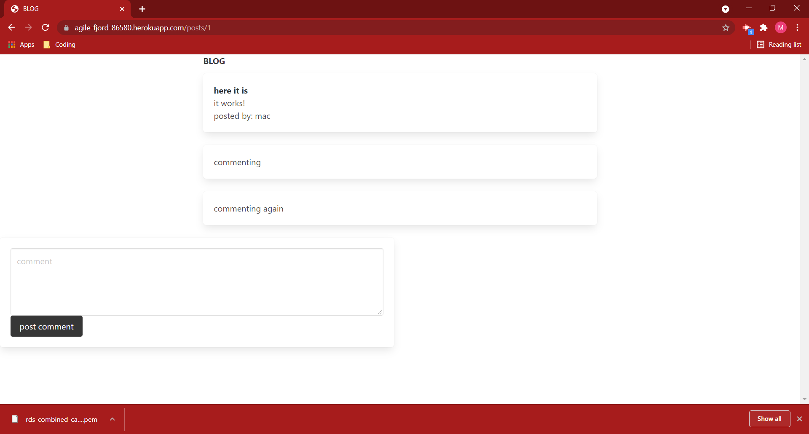

# tech-blog

## Description:

---

A solo-built application. Handleblars viewengine, Express/Node backend. A blog app that allows the user to create an account, post, and comment on posts. Keeps track of user through cookies to allow easy return. Hashes the passwords for security. Functionally sound, sparsely designed.

## Table of Contents:

---

1. [Description](#description)
2. [Installation](#installation)
3. [Usage](#usage)
4. [Video](#video)
5. [Collaboration](#collaboration)
6. [Tests](#tests)
7. [Questions?](#questions?)
8. [GitHub](#gitHub)
9. [License](#license)

## Installation

---

visit https://agile-fjord-86580.herokuapp.com/

## Usage

---

Create an account, the cookie keeps you logged in for the duration of its lifespan. You can see other posts, comment, and post your own thoughts.

## Video

---

[]

## Collaboration:

---

For now, just follow the [Contributor Covenant](https://www.contributor-covenant.org/)

## Tests

---

none yet

## Questions?

---

Please contact me at:
My [GitHub](https://github.com/Windowmac)

Or Email:
<mckendree.strommer@gmail.com>

## License:

---

Licensed under [MIT License](https://opensource.org/licenses/MIT)
